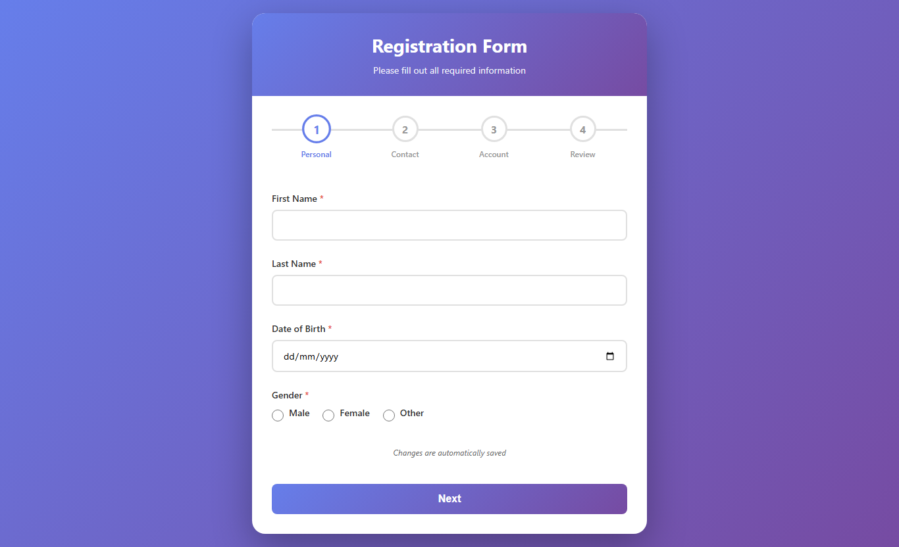

# FormFlow

> A beautiful, responsive multi-step form with smooth transitions, real-time validation, and autosave functionality.



## ✨ Features

### Core Functionality
- **4-Step Registration Process** - Organized flow through Personal, Contact, Account, and Review stages
- **Dynamic Progress Bar** - Visual indicator that updates as users complete each step
- **Real-time Validation** - Instant feedback on form inputs with custom error messages
- **Final Summary Review** - Complete overview before submission
- **Success Confirmation** - Beautiful confirmation screen after form submission

### Enhanced Features
- **🔄 Autosave** - Automatically saves progress to localStorage every 500ms
- **💾 Data Persistence** - Restores user data when returning to the form
- **🔒 Password Toggle** - Show/hide password functionality for better UX
- **✅ Smart Validation** - Email format, phone number, password strength, and field matching
- **🎨 Smooth Animations** - CSS transitions and fade effects between steps
- **📱 Fully Responsive** - Optimized for desktop, tablet, and mobile devices
- **♿ Accessible** - ARIA labels and keyboard navigation support

## 🎯 Demo

Open `https://muhammadkhuzaima12.github.io/FormFlow/` in any modern web browser to see FormFlow in action!

## 📋 Form Structure

### Step 1: Personal Information
- First Name (required)
- Last Name (required)
- Date of Birth (required)
- Gender (required)

### Step 2: Contact Information
- Email Address (required, validated)
- Phone Number (required, validated)
- Street Address (required)
- City (required)
- Country (required, dropdown)

### Step 3: Account Information
- Username (required, min 4 characters)
- Password (required, min 8 characters, toggleable)
- Confirm Password (required, must match)
- Interests (optional, checkboxes)
- Bio (optional, textarea)

### Step 4: Review & Submit
- Summary of all entered information
- Edit capability by going back to previous steps
- Final submission

## 🎨 Design Highlights

### Color Scheme
- **Primary Gradient**: Purple (`#667eea` → `#764ba2`)
- **Success Green**: `#27ae60`
- **Error Red**: `#e74c3c`
- **Neutral Grays**: Various shades for text and borders

### Responsive Breakpoints
- **Desktop**: > 768px - Full layout with side-by-side buttons
- **Tablet**: ≤ 768px - Optimized spacing and padding
- **Mobile**: ≤ 600px - Stacked buttons, larger touch targets
- **Small Mobile**: ≤ 400px - Ultra-compact with hidden labels

### Animations
- **Fade In**: Smooth entry for new steps
- **Shake**: Error message animations
- **Scale**: Progress circle transformations
- **Slide**: Progress bar transitions

## 🔧 Technical Details

### Technologies Used
- **HTML5** - Semantic markup
- **CSS3** - Modern styling with Flexbox and animations
- **Vanilla JavaScript** - No frameworks or dependencies
- **LocalStorage API** - Data persistence
- **ES6+** - Modern JavaScript features

### Browser Support
- ✅ Chrome (latest)
- ✅ Firefox (latest)
- ✅ Safari (latest)
- ✅ Edge (latest)
- ✅ Mobile browsers (iOS Safari, Chrome Mobile)

### Performance
- **Lightweight** - Single HTML file (~35KB)
- **No Dependencies** - Zero external libraries
- **Fast Load Time** - Instant page rendering
- **Optimized Autosave** - Debounced for performance

## 🎓 Learning Concepts

This project demonstrates:

1. **JavaScript Form Validation**
   - Required field checking
   - Email regex validation
   - Phone number validation
   - Password strength requirements
   - Field matching (password confirmation)

2. **CSS Animations & Transitions**
   - Keyframe animations (`@keyframes`)
   - Transform properties
   - Transition timing functions
   - Hover and focus states

3. **State Management**
   - Step navigation logic
   - Form data tracking
   - Error state handling
   - Progress calculation

4. **Local Storage**
   - Saving form data
   - Retrieving saved data
   - Data serialization (JSON)
   - Cleanup after submission

5. **Responsive Design**
   - Mobile-first approach
   - Media queries
   - Flexible layouts
   - Touch-friendly interfaces

6. **User Experience**
   - Progressive disclosure
   - Clear visual feedback
   - Error prevention
   - Autosave functionality

## 📱 Mobile Features

- **16px Input Font Size** - Prevents iOS zoom
- **Vertical Button Stack** - Better mobile UX
- **Larger Touch Targets** - Easy interaction
- **Optimized Spacing** - Comfortable viewing
- **Adaptive Labels** - Hidden on very small screens

## 🔐 Validation Rules

| Field | Rule |
|-------|------|
| First Name | Required, non-empty |
| Last Name | Required, non-empty |
| Date of Birth | Required, valid date |
| Gender | Required, radio selection |
| Email | Required, valid email format |
| Phone | Required, 10+ characters, valid format |
| Address | Required, non-empty |
| City | Required, non-empty |
| Country | Required, selection from dropdown |
| Username | Required, minimum 4 characters |
| Password | Required, minimum 8 characters |
| Confirm Password | Required, must match password |

## 🛠️ Customization

### Change Colors
Edit the CSS variables in the `<style>` section:
```css
/* Primary gradient */
background: linear-gradient(135deg, #667eea 0%, #764ba2 100%);

/* Change to your brand colors */
background: linear-gradient(135deg, #YOUR_COLOR_1 0%, #YOUR_COLOR_2 100%);
```

### Modify Steps
Add or remove steps by:
1. Updating `totalSteps` variable
2. Adding/removing `.form-step` divs
3. Adding/removing `.step` progress indicators
4. Updating validation logic

### Adjust Autosave Interval
Change the debounce delay (default: 500ms):
```javascript
form.addEventListener('input', debounce(() => {
    saveFormData();
}, 500)); // Change 500 to your preferred milliseconds
```

## 📂 File Structure

```
FormFlow/
│
├── multi-step-form.html    # Main application file
└── README.md                # Project documentation
```

## 🐛 Troubleshooting

### Autosave Not Working?
- Check browser localStorage support
- Clear localStorage: `localStorage.clear()` in console
- Ensure JavaScript is enabled

### Form Not Submitting?
- Check console for errors
- Verify all required fields are filled
- Ensure validation passes on all steps

### Styling Issues?
- Clear browser cache
- Check for CSS conflicts if integrating into existing site
- Verify viewport meta tag is present

## 🤝 Contributing

This is an educational project! Feel free to:
- Fork and modify for your needs
- Add new features
- Improve validation
- Enhance animations
- Report issues or suggestions

## 📝 License

This project is open source and available for educational and commercial use.

## 🎉 Acknowledgments

Built as part of Assignment 4 - Multi-Step Form with Progress Indicator

### Key Learning Outcomes
✅ JavaScript form validation mastery 
✅ CSS animations and transitions 
✅ Next/previous button functionality 
✅ Autosave implementation 
✅ Smooth step transitions 
✅ Responsive design principles 

## 📞 Support

For questions or suggestions, feel free to open an issue or reach out!

---

**FormFlow** - Making multi-step forms beautiful and user-friendly! ✨

Made with 💜 by Muhammad Khuzaima 